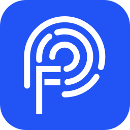

  

## 
<b><a href="README.md">English</a> | <a href="README_CN.md">简体中文</a></b>

# 简介

指纹通浏览器(fpbrowser) 是基于 [Chromium](https://dev.chromium.org) 的指纹浏览器，支持 Windows 7 及以上操作系统，并计划在未来支持 Mac、Android、Linux 等操作系统。

## 什么是浏览器的指纹?

网站使用一些参数，如 IP 地址，操作系统（比如 Windows 或 macOS）、屏幕分辨率、系统安装了哪些字体，地理位置，时区等等，这些看似无关紧要的信息，当汇集在一起时，就形成了一个浏览器指纹。
部分浏览器指纹特点有：

- 1：他可以在不同的工作模式下，比如隐身模式和非隐身模式中保持一致。
- 2：部分指纹在相同浏览器，不同版本中表现一致，
- 3：甚至在不同的浏览器中表现一致。

因此，指纹的唯一性，能让网站识别出是一个特定的访问者。世界上所有头部电商平台（亚马逊，虾皮，淘宝），社交网站（facebook，instagram）等等，都在使用指纹技术跟踪用户。一项数据显示，有 60%的网站使用 canvas 指纹跟踪用户。

通常电商网站和社交平台都希望自己的用户是真实的，他们不愿意看到一个人掌握大量的账户，防止欺诈，滥用等等。但是，在现实中，尤其是在业务需求中，一个团队或企业运营多个账户往往是必要的。
那么对于这种用户，如何解决这个被指纹跟踪的问题？

## 指纹浏览器提供的方案

创建安全独立的指纹环境，相当于，提供独一无二指纹环境的安全容器。每个指纹环境互相之间的 cookie，缓存文件，本地存储等等，都是完全隔离的。每个浏览器配置文件之间，无法互相泄露信息。确保多平台账号的防关联，通过在线实时检测指纹环境，提高批量管理的安全性和高效性。

## 指纹通浏览器的核心技术

- 首先：数据加密。包括本地存储，指纹数据存储，都进行了加密，确保 100%数据安全。
- 第二：批量环境创建，支持多平台账号管理，账密自动填充。
- 第三：通过 800 多个的代码点位修改，实现 20 多个可定制参数的真实浏览器指纹。
- 第四：提供的指纹环境，完美通过检测平台的质量检测。
- 第五：在本地数据存储，环境启动上，做了极致优化。在应对需要大量环境，高并发执行的自动化爬虫，存储需求上更加友好，执行上更加高效。对比 adspower,我们的本地存储需求减少 20-40%，对比比特浏览器，我们的环境启动速度提高了 30%-50%。
- 最后：我们通过研究竞品，不断升级内核功能，比如我们内核支持这些特色能力。 字体侧载能力（下载的字体不需要安装到系统中，就可以加载使用），字体 fallback 能力（解决加载 fake 字体导致的网页崩溃），安卓模拟中随机压力检测（提供真实机才有的压力传感值），构造 pc 和安卓模拟器之间的 JavaScript 的执行环境差异（使得模拟器更像真实机的执行环境），指纹改造不破坏 chrome 的安全机制，提供完整沙盒环境（很多指纹浏览器完全删除了沙盒，暴露了更多的安全隐患），提供网页反调试解禁（支持任意网站的调试）等等。
  这些是我们的核心技术点。

产品主要划分为 8 个模块，分别是：环境管理，代理管理，应用中心（也就是浏览器的插件），RPA 管理（实现无代码自动化），API 管理（提供代码编程接口），用户体系（对应团队管理模块），支付和订阅（对应费用管理模块），营销相关的支持（对应推广奖励模块）

# 准备工作

首先，从发布页面或[官网](https://www.fpbrowser.com/)下载最新的 指纹通浏览器 安装包并将其安装到计算机上。

## 创建新的浏览器环境

1. 打开 指纹通浏览器 并选择“创建环境”。

2. 修改弹出对话框中的配置信息或使用默认设置。

## 启动浏览器环境

1. 单击已创建环境中的“启动”按钮，以打开新创建的浏览器环境。
2. 新启动的浏览器即为新的指纹环境。

# 可用的指纹修改

可以使用 [fingerprintjs](https://fingerprintjs.github.io/fingerprintjs/) 和 [browserleaks](https://browserleaks.com/) 来测试指纹修改效果。

- 操作系统：修改 `userAgent` 中的操作系统部分。
- 浏览器版本：修改 `userAgent` 中的浏览器版本。
- 代理设置：内核支持代理链。
- 用户代理：修改 `userAgent`。
- 语言：修改 `navigator.language`、`navigator.languages`，根据 IP 自动匹配。
- 时区：修改 `new Date()` 中的时区，根据 IP 自动匹配。
- WebRTC
- 地理位置：修改 `navigator.geolocation.getCurrentPosition()` 中的经度和纬度，根据 IP 自动匹配。
- 分辨率：修改 `screen.width`/`screen.height`。
- 字体：修改支持的字体列表。
- Canvas：修改 Canvas 2D 绘制差分像素。
- WebGL 图像：修改 WebGL 绘制差分像素。
- WebGL 元数据：WebGL 厂商、WebGL 渲染等。
- AudioContext：修改 AudioContext 中的 `getChannelData` 和 `getFloatFrequencyData` 的差异数据。
- ClientRects
- Speech Voices
- CPU：修改 `navigator.hardwareConcurrency` 的 CPU 核心数。
- 内存
- 设备名称
- MAC 地址
- Do Not Track
- 端口扫描保护
- 硬件加速

# 自动化

fpBrowser 基于 Chromium 开发，可以使用 playwright 或者其他 chromium 的自动化测试工具进行开发。
需要自动化工程代码,请联系我们.

同时支持 RPA(automa),并制定执行计划。

# 支持和加入

fpBrowser 还不完善。如果您对 fpBrowser 感兴趣，可以通过以下方式加入我们：

1. 直接贡献代码、提供功能和修复错误。
2. 安装 fpBrowser，访问您经常使用的网站，并提供有关无法使用的情况的反馈，以帮助解
3. 提供有关 fpBrowser 的反馈和建议，以帮助我们改进产品和增强用户体验。
4. 在社交媒体上分享您对 fpBrowser 的看法和使用体验，并向其他人推荐该产品。
5. 加入 fpBrowser 的开发者社区，与其他用户和开发人员进行交流和讨论。

# 免责声明

本免责声明旨在明确指出，fpBrowser 项目为技术交流、学习和研究之用，不得将本项目技术用于任何非法目的或破坏行为。作者对于任何使用本项目对他人或系统造成的损害概不负责。

使用本项目时，您必须明确并承诺，不会利用该技术来实施非法活动、侵犯他人的权益或对系统进行攻击。任何使用本项目中的技术所导致的任何意外、损失或损害，包括但不限于数据损失、财产损失、法律责任等问题，都与发表本项目的作者无关。

本文提供的技术信息仅供学习和参考之用，不构成任何形式的担保或保证。发表本项目的作者不对技术的准确性、有效性或适用性做任何声明或保证。

# 联系我们
可提供完整商用系统的私有化部署方案.
同时提供完整商用产品收购方案。

- email: [fpbrowser@163.com ](mailto:fpbrowser@163.com)
- 官网: [https://www.fpbrowser.com](https://www.fpbrowser.com)
- QQ 群: `209256761`

# 致谢

1. [fingerprintjs](https://fingerprintjs.github.io/fingerprintjs/)
2. [browserleaks](https://browserleaks.com/)
3. [Chromium](https://dev.chromium.org)
4. [vue-element-admin](https://github.com/PanJiaChen/vue-element-admin)
